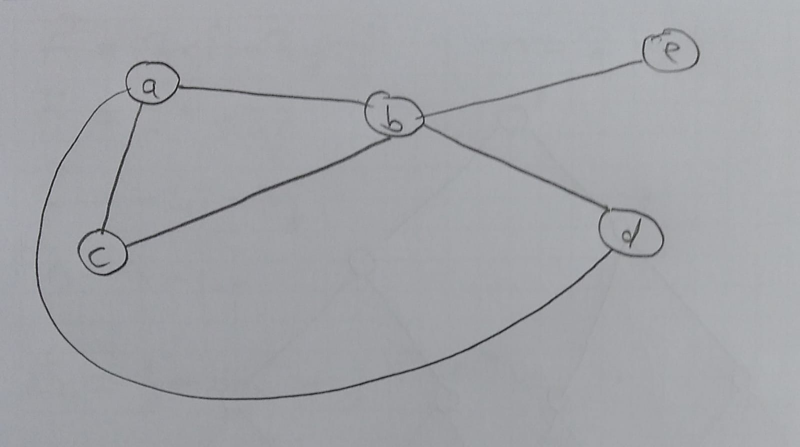
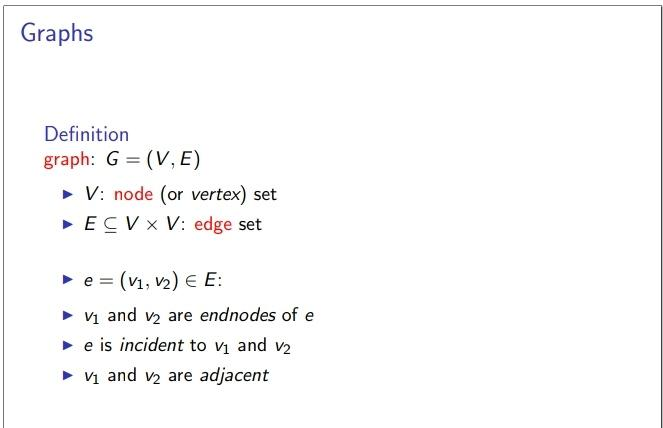
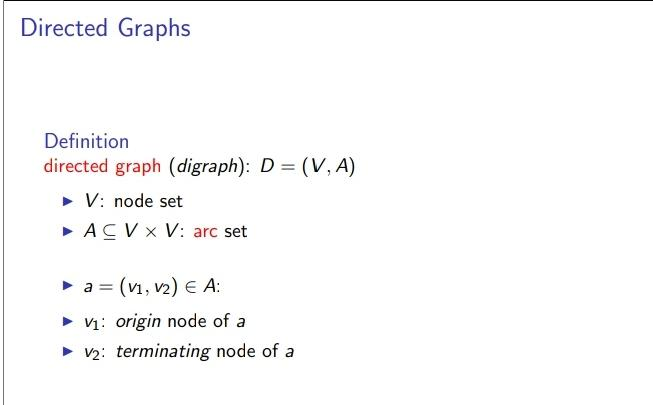
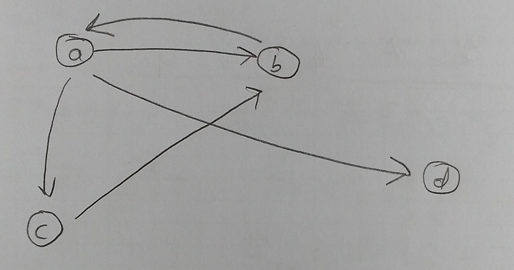
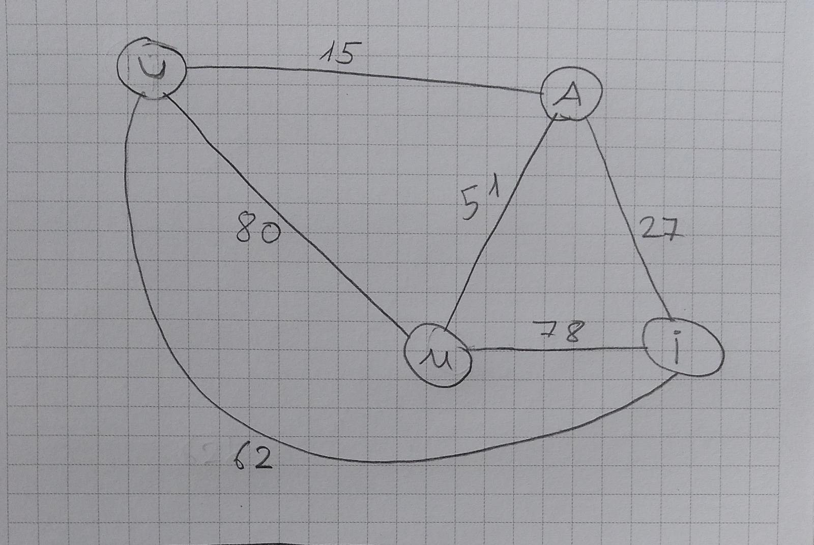
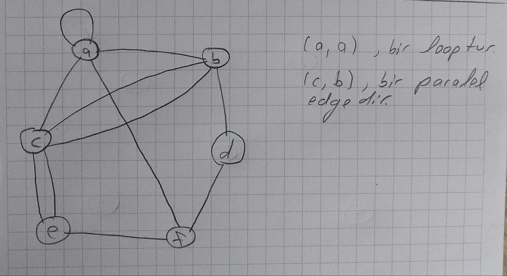
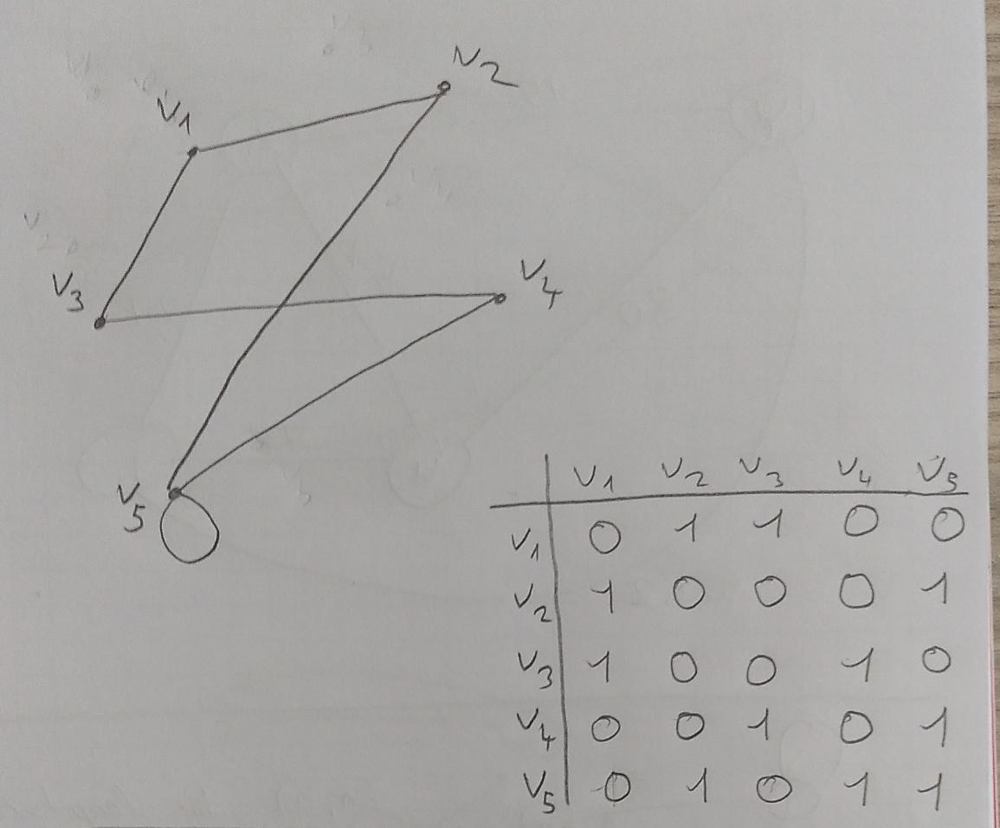
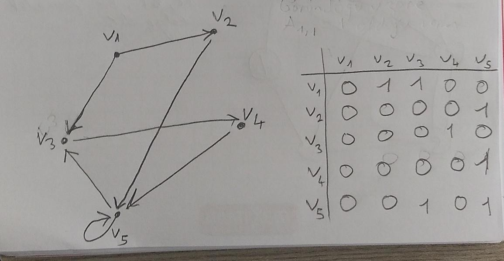
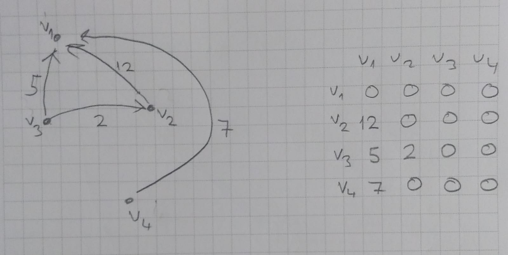

Merhaba arkadaşlar, bu yazımda sizlerle graf teorisi hakkında konuşacağım.
İlk olarak graf teorisi ne işe yarar bunu konuşalım. Graf teorisi, bir şehirden giden başka bir şehire
giden en kısa yolu bulmak vs. için kullanılır.

Şimdi sizlerle örnek bir grafa göz atalım.

Şimdi bu graf, matematik dilinde nasıl gösterilir ona bakalım.

*G, Yönelimsiz Graf(Undirected Graph) olmak üzere*
G = (V, E)
V = {a, b, c, d, e}
E = {(a, c), (a, b), (c, b), (b, e), (b, d)}

Şimdi burada G, V ve E nedir bunu inceleyelim.

G, tanımını yaptığımız graf [Graph]
V, graftaki düğümler(node) [Vertex]
E, graftaki düğümlerin birbiriyle yaptığı bağların kümesi [Edge]

Bu arada yukarıdaki resimdeki tanımları da açıklamadan geçemeyeceğim.
$e = (v_{1}, v_{2}) \1n E$
*$v_{1}$ and $v_{2}$ are adjacent*

Gördüğünüz üzere, V kümesinde a, b, c, d, e nodeları var. E deki elemanlara bakalım
(a, c) a ile c arasında bir bağlantı vardır. (*$v_{1}$ and $v_{2}$ are adjacent* tanımda bu cümle geçmeseydi sadece a dan c ye bir bağlantı vardır diyebilirdik. c den a ya bir bağlantı vardır diyemezdik.)
(a, b) a ile b arasında bir bağlantı vardır.
(c, b) c ile b arasında bir bağlantı vardır.
(b, e) b ile e arasında bir bağlantı vardır.
(b, d) b ile d arasında bir bağlantı vardır.

# Yönelimli Graflar(Directed Graph)

Bu resmi açıklayalım.
$a=(v_{1} , v_{2})$
$v_{1}$ : origin node of a
$v_{2}$ : terminating node of a

Yani sadece $v_{1}$ düğümünden $v_{2}$ düğümüne bir bağlantı vardır diyebiliriz. $v_{2}$ den $v_{1}$ e bir bağlantı olduğunu söyleyemeyiz.

Aşağıda örnek bir Yönelimli Graf var.

D = (V, A)
V = {a, b, c, d}
A = {(a, b), (b, a), (a, c), (c, b), (a, d)}

(a, b) a dan b ye bir bağlantı vardır.
(b, a) b den a ya bir bağlantı vardır.
(a, c) a dan c ye bir bağlantı vardır.
(c, b) c den b ye bir bağlantı vardır.
(a, d) a dan d ye bir bağlantı vardır.

Buradan gördüğünüz gibi d den a ya bağlantı olması için A kümesi içinde (d, a) da olmak zorundaydı.

# Ağırlıklı Graflar(Weighted Graphs)

Eğer bir graphın kenarları belli bir değeri de içinde taşıyorsa(nasıl bir tanım yaptım ben de bilmiyorum ama örnek verince anlatmaya çalıştığım şey çok iyi anlaşılacaktır diye düşünüyorum.)
Bu grafa ağırlıklı graf denir. Bu ağırlık değerleri *cost, length distance, delay, probabilty vs.* olabilir. Bir örnek verelim:
Uşak - Ankara arası 15km
Ankara-İstanbul arası 27km
İstanbul-Malatya arası 78km
Malatya-Uşak arası 80km
Malatya-Ankara arası 51km
Uşak-İstanbul arası 62km

Çizeceğimiz grafta
Uşak'ı U
Ankara'yı A
İstanbul'u İ
Malatya'yı M
olarak gösterelim.

# Multigraphs

$e_{1}$, a düğümünden b düğümüne giden bir edge olsun.
Eğer a düğümünden b düğümüne giden birden fazla edge varsa, biz bu edge'e *parallel edge* deriz.

Eğer bir düğümden yine aynı düğüme giden bir edge varsa biz buna *loop* deriz.

plain graph: loop ve parallel edge içermeyen graflara denir.

multigraph: plain graph olmayan grafa denir.

# Komşuluk Matrixi (Adjacent Matrix)

yukarıdaki resim için konuşalım.
$A_{1},_{2} = 1$
olduğu için $v_{1}$ den $v_{2}$ ye bir edge vardır. $A_{2}{1} = 1$  olduğu için $v_{2}$ den $v_{1}$ ye de edge vardır. Yani hem $v_{1}$ den $v_{2}$ ye gidilebilir hem de $v_{2}$ den $v_{1}$ e gidilebilir.

yukarıdaki resim için konuşalım.
$A_{1},_{2} = 1$
olduğu için $v_{1}$ den $v_{2}$ ye bir edge vardır. Ama $A_{2}{1} = 0$  olduğu için $v_{2}$ den $v_{1}$ edge yoktur. Yani $v_{1}$ den $v_{2}$ ye gidilebilir ama $v_{2}$ den $v_{1}$ e gidilemez.

$$
\begin{align*}
  & \phi(x,y) = \phi \left(\sum_{i=1}^n x_ie_i, \sum_{j=1}^n y_je_j \right)
  = \sum_{i=1}^n \sum_{j=1}^n x_i y_j \phi(e_i, e_j) = \\
  & (x_1, \ldots, x_n) \left( \begin{array}{ccc}
      \phi(e_1, e_1) & \cdots & \phi(e_1, e_n) \\
      \vdots & \ddots & \vdots \\
      \phi(e_n, e_1) & \cdots & \phi(e_n, e_n)
    \end{array} \right)
  \left( \begin{array}{c}
      y_1 \\
      \vdots \\
      y_n
    \end{array} \right)
\end{align*}
$$
